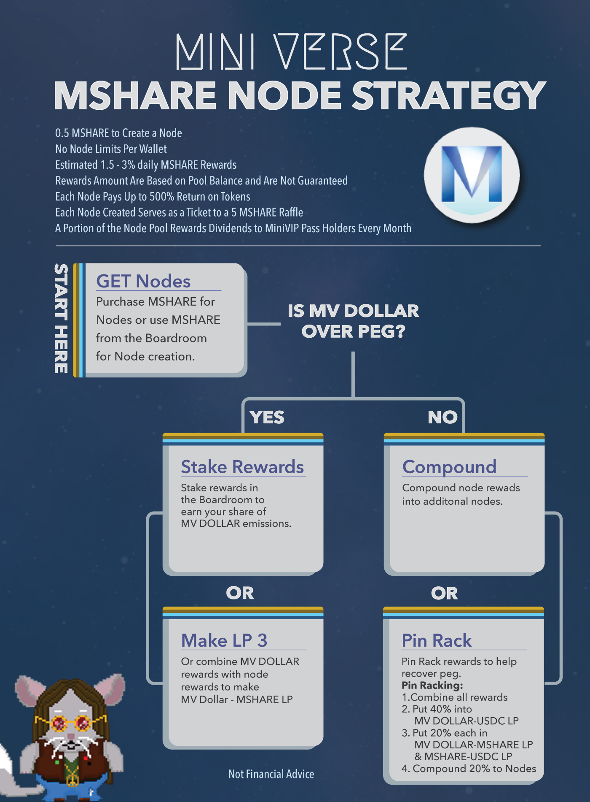

# 📍 Nodes

## MSHARE Nodes

### Details

* 0.5 MSHARE cost per node. **YOU CAN NOT WITHDRAW YOUR NODE** once bought you are locked in and will earn up to 500% ROI for each node over time. If you want more flexible nodes check out [NFT Nodes](../nft-gamefi-utility/gamified-nft-nodes/)
* Unlimited nodes per account
* Estimated 1.5-3% daily MSHARE rewards paid (tapering figure), returns are based on node pool balance and are not guaranteed
* Up to a max 500% ROI on each node (adjustable figure), max possible ROI is based on node pool balance and is not possible to guarantee
* Each node created weekly also gives you 1 entry to a weekly 5 MSHARE prize sent to a random account, more entries more chance to win
* A portion of the node pools MSHARE will be rewarded to the [MiniVIP Pass dividends](../nft-gamefi-utility/casinofi-slots/minivip-pass-nft.md) every month

### Disclaimer & Risks

Note that investing in DeFi is experimental and risky, there is no guaranteed return on any product or investment. By using MiniVerse Finance, you agree that the MiniVerse Finance team is not responsible for any financial losses from investing in MiniVerse Finance nor do we promise any returns now or in the future. Nodes are highly experimental locked staking pools and the total amount of rewards that can be paid are determined by a number of factors including the number of nodes created, the TWAP expansion rates of the protocol and the performance of investments made by the treasury.

### What is a node? 

Users may be familiar with the concept of validator nodes which as the name suggest validate transactions on a blockchain, in most blockchain networks these validators are rewarded for their efforts with native tokens. MSHARE Nodes are not transaction validator nodes however they follow this concept of rewarding locked stakers with MSHARE rewards for their efforts. Users deposit MSHARE to purchase a node which in turn deposits a portion of that into a reward pool that drips daily rewards back to all node holders thereby granting a passive income in return for locking up your MSHARE. The remaining MSHARE is sent to the treasury and used to increase protocol sustainability through several mechanisms depending on TWAP including adding to the MSHARE-USDC LP and/or investing in other protocols to generate a non protocol specific income that can be used to directly support the system. Our node operates in a similar manner to the many well known investment type node projects in existence such as Project x and Vapornodes.

### Sustainability 

Nodes often suffer from sustainability issues due to their tokens having no other purpose than simply as a reward token for selling, this too is an issue for algorithmic stable coin protocols. At MiniVerse Finance adding strong utility to MSHARE is something we have focused on so far through unique yielding opportunities with partner protocols and soon through our decentralized lending and borrowing platform. In order to ensure our MSHARE nodes are sustainable and achieve their intended outcome we take inspiration from EMP Money's successful implementation.

### Education 

Much like in our base layer seigniorage protocol education and strategy play a large part in ensuring sustainability of the system. If the majority of participants operate in unison and follow the same strategy the system has a better chance at maintaining sustainability over the long run, essentially making the system a social experiment in game theory. We have produced a detailed strategy flowchart for users to follow based on the TWAP of the original peg token below and often remind participants of the current optimal strategy to follow for protocol health which in turn helps protect the longevity of your investment.

### ROI Caps & reward rates

This includes implementing mechanisms such as a maximum cap on total ROI that is possible to receive from a single node (currently 500%) and tweaking of the daily drip rate to maintain a sweet spot of 1.5-3% so it remains above that available for single staking MSHARE but not such that it reduces the benefit locked staking will have for the protocol. There is no limit to the number of nodes someone can own however the more you own the greater your daily yield back in MSHARE. **Please note that this maximum cap is not your guaranteed return from each node it is your maximum possible return from each node, it is not possible to guarantee a return in DeFi or investing**

### Gamification

Another feature adding to sustainability is our gamification, every week we will reward a randomly chosen node creator each week with a 5 MSHARE reward. To enter all that is required is to create a node during that week, each node created during the week will earn you 1 entry to the contest, multiply your chances of winning by creating more nodes during the week.

### Seigniorage protocol support

A major benefit of having a node system tied to an existing seigniorage protocol is that the rewards pool can be topped up from minted seigniorage and the node pool in turn locks up the supply of the peg token thereby creating a synergy between the two. As mentioned above a portion of the total deposits are sent to the treasury to be used to maintain sustainability of the system as below:

**TWAP < 1**, Treasury balance of MSHARE is burnt to decrease supply permanently\
**TWAP > 1.01**, Treasury balance is used to add to MSHARE-USDC LP by slowly selling half of the MSHARE and entering the LP this will increase total liquidity, add to protocol owned liquidity and increase stability of MSHARE\
**TWAP > 1.1**, Along with the above strategy a portion of the treasury balance is also slowly sold to invest in non protocol specific investments to generate a return that can be fed back into the system at lower TWAPs
